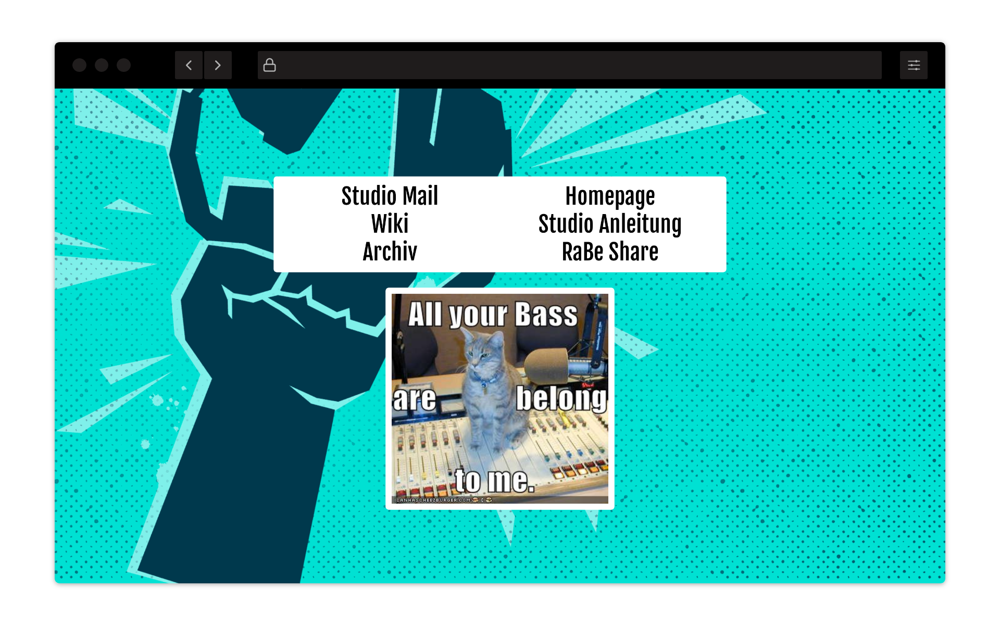

# RaBe Cat Landing Page

 [](https://renovatebot.com/) [](https://github.com/pre-commit/pre-commit)

Overengineered intranet landing page for [Radio Bern RaBe](https://www.rabe.ch).



## Usage

1. Navigate to page
2. Find services
3. See cat
4. ???
5. PROFIT!!!

### Configuration

See `python app/server.py --help` for usage message and configuration info.

### Docker

```bash
docker run --rm -ti -p 8080:8080 radiorabe/catpage
```

Connect to [localhost:8080](http://localhost:8080).

### Docker-compose

```bash
cp env.example .env
$EDITOR .env
docker-compose up -d
```

## Contributing

Contributions are welcome. Please keep in mind that everything here is completely overengineered.

### Running tests

You can run our tests with `pytest`. Please keep in mind that we expect to keep the coverage at
100% and that this is enforced by CI.

```bash
pipx install poetry
poetry install
poetry run pytest
```

### Formating code using a pre-commit hook

There is a pre-commit hook facility that tests code for formating and validity. You should install run
this on your dev env to ensure that all the code is properly formatted and your changes will pass CI.

```bash
pip install pre-commit
pre-commit install
```

### Commiting with commitizen

This project uses [conventional-changelog](https://github.com/conventional-changelog/conventional-changelog) style
commit messages to help generate proper releases. Please check out the [`git-cz`](https://github.com/commitizen/cz-cli)
helper to help with formatting commit messages.

```bash
npm install -g commitizen cz-conventional-changelog
```

### Creating a Pull Request

Once your contribution is ready you can use the GitHub interface to create a pull request. Please try to keep
your individual contribution self contained in a single squashed commit. This helps so that the maintainers
can just hit "Squash and merge" instead of "Rebase and merge".

## License
This application is free software: you can redistribute it and/or modify it under
the terms of the GNU Affero General Public License as published by the Free
Software Foundation, version 3 of the License.

## Copyright
Copyright (c) 2019 [Radio Bern RaBe](http://www.rabe.ch)
